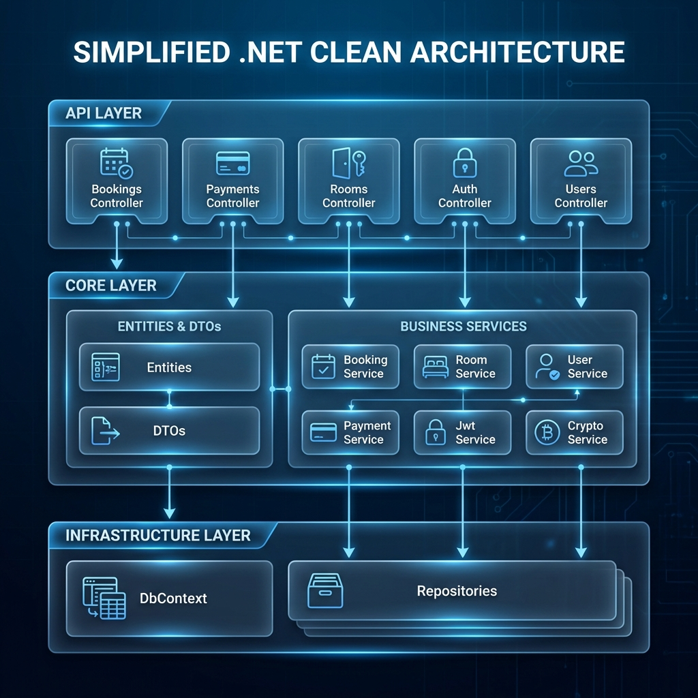
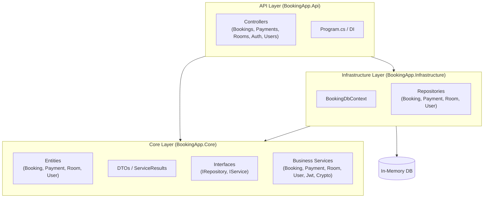

# Booking Application - Monolithic Architecture Example

This is a simple ASP.NET application for a booking system, designed as a monolithic architecture example using the repository pattern. It is targeted for junior developers and students.

## Architecture

The application is built using a clean, layered monolithic architecture:


### Detailed Component Architecture



### Component Diagram (Mermaid)



### Key Architectural Patterns

- **Monolithic Architecture**: Simplified deployment and development using a single solution.
- **Repository Pattern**: Decouples business logic from data access details.
- **Dependency Injection**: Centralized service registration and resolution.
- **JWT Authentication**: Secure user sessions using token-based auth.
- **Result Pattern**: Uniform service responses with `ServiceResult<T>`.

## Features

- [x] User registration & Login (JWT)
- [x] Room Management (CRUD)
- [x] Room Booking & Cancellation
- [x] Payment Management & Tracking
- [x] Advanced Validation (Overlaps & Integrity)
- [x] Automated Notifications (Console)

## How to Run

1.  Clone the repository and navigate to the root:
    ```bash
    cd demo-monolitic
    ```
2.  Run the application:
    ```bash
    dotnet run --project BookingApp.Api/BookingApp.Api.csproj
    ```
3.  Access Swagger UI: Check the console output for the URL (e.g., `https://localhost:5001/swagger`).